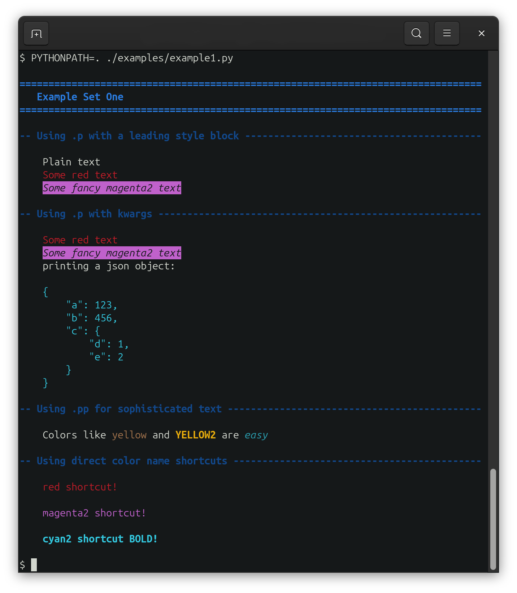

# Styled Term

Simple but effective styling for python in the terminal.

This is **not** intended to be as feature rich as something like [Rich](https://github.com/Textualize/rich),
but is intentionally designed for supporting easier to read output from python programs that produce a
"stream" of output on the command line.


## 1. Simple Example

```python
from styledterm import StyledTerminalPrinter

P = StyledTerminalPrinter(default_header_color={"H1":"blue2","H4":"blue"})
P.default_header_center = False
P.curr_auto_indent_level = 1

P.H1("Example Set One")

P.H4("Using .p with a leading style block")
P.p("Plain text")
P.p("[red]Some red text")
P.p("[magenta2 reverse italic]Some fancy magenta2 text")

P.H4("Using .p with kwargs")
P.p("Some red text",color="red")
P.p("Some fancy magenta2 text",color="magenta2",styles=["reverse","italic"])
P.p("printing a json object:")
P.pjson({"a":123,"b":456,"c":{"d":1,"e":2}},color="cyan2")

P.H4("Using .pp for sophisticated text")
text = "Colors like [yellow]yellow[/] and [yellow2][bold]YELLOW2[/] are [cyan][italic]easy[/]"
P.pp(text)

P.H4("Using direct color name shortcuts")
P.red("red shortcut!")
P.nl()
P.magenta2("magenta2 shortcut!")
P.nl()
P.cyan2("cyan2 shortcut BOLD!",bold=True)
P.nl()
```



See the example files for additonal usage.

